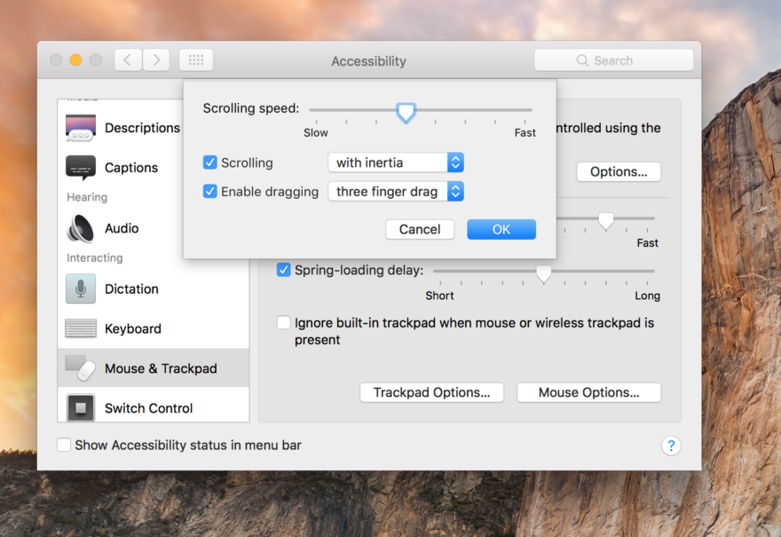
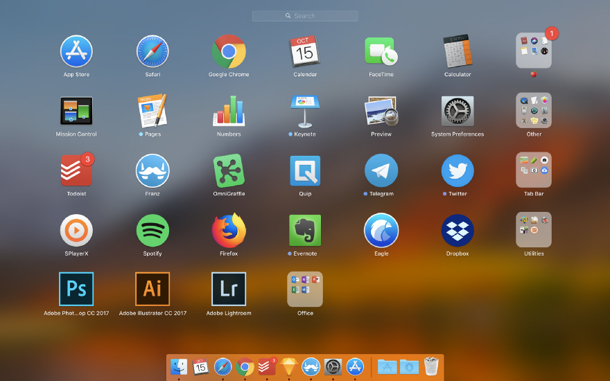
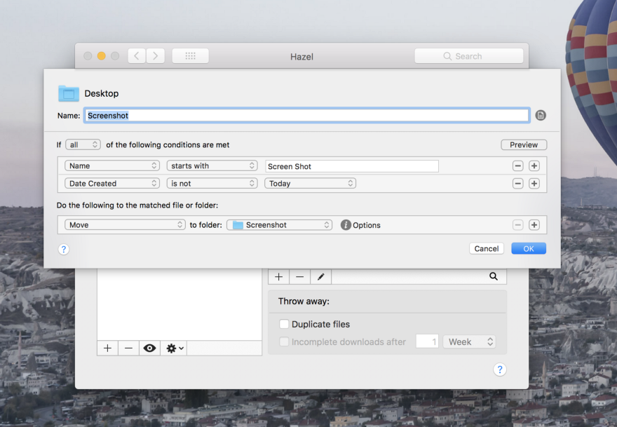
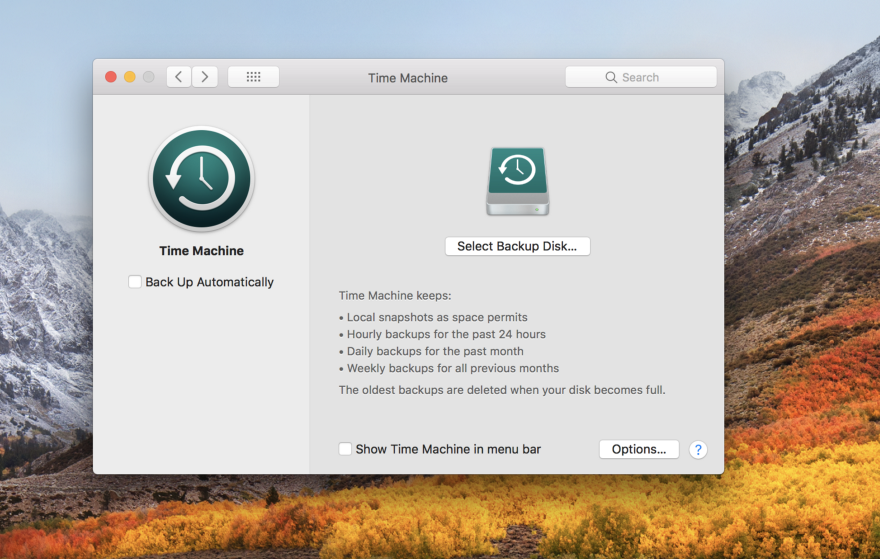

Buying a new mac is one of the most exciting things I enjoy. The experience is sacred, since owning a new Mac is far less frequent than switching new phones (not that I switch new iPhone every year). The box-opening is a total satisfaction, a box is slowing sliding down from the cover with friction, and then you see the iconic logo at the center of the beautifully crafted art piece. Seeing the screen lit up for the first time, you almost forget how many junk files you have in your old mac and it has given you a clean slate. *A new chance to start over.*

I was given two choices.

I can either effortlessly copy everything from the old Mac using Time Machine Backup or set it up as a new Mac. Of course, Time Machine backup guarantees everything will be the same, but old files remain after years of upgrading OS and unused apps.

I picked the latter one.

###Set up as a new mac, Always.

Here’s why:

1. All my working files are stored on either Google Drive or Dropbox. If you are not, you should. It’s 2017. Getting all files and folders sync up shouldn’t be a problem.
2. It’s almost time to clean up my Applications & Library folder. This should become a ritual to keep all the good apps and getting rid of the bad ones. Also, the process of typical deleting an app, by throwing the icon into the trash will not clear all its associated files. Library, the one hidden folder (Press Alt when you select Go on the Menu Bar in Finder) that you wouldn’t dare to touch, is also growing bigger after tons of installations all over App Store and the web.
3. Taking a closer look at apps that I use every day (Sketch, Quip, Illustrator, Evernote, Todoist, Franz and etc. ) Most of them are either web service based or include export functions for their settings, plugins, templates. Not much effort should I spent on settling down for these apps.

Yet, the biggest challenge in setting up a new mac is still getting the same configurations & settings. iCloud might have sync your calendar, contacts, Safari bookmarks and even your passwords across all Apple’s device. You will still need to perform OS-based settings, install third-party apps and reset their settings all over again. And you should consider this clearly before making the decision.

I made a step-by-step guide just for that purpose:

##1. Re-configuring Keyboard Shortcuts

Most preference panel settings are not transferable, so I just have to set it up again. Typically, I switch Spotlight (Command + Space) and *Switch Input Method* (Alt + Space), because I switch input method more frequent than spotlight.

I’m also heavily addicted to *Show Desktop* (Command + F3), by dragging screenshots or files from desktop to various windows. The missing F3 key has been replaced by “3” key on my Touch Bar Macbook Pro.

Three-finger Drag weirdly has relegated to *Accessibility* page since OS X Sierra. You will need select *Mouse & Trackpad*, and select *Trackpad Options*, in order to enable the Three-finger Drag.

##2. Reinstalling All Applications

Download back all necessary apps from App Store should be easy. Try to recover those you need in daily operation first, but not everything in your purchase record. Next, I download all apps that I’m actively subscribing. Then the third type is those license-code activated apps. I looked over your old email threads and track down license codes. Some of them might have active device limitation, so you might want to unlink from the original Mac as well.

##3. Restoring Files and Folder
I use Dropbox and Google Drive to sync all my working files. So it just takes few minutes to set up and some time to download everything back.

##Taking Control of Menu Bar & Dock Bar
Next thing is getting the menu bar and dock bar in place. Few of my favorites are Hazel, [Day-0](https://www.macupdate.com/app/mac/43284/day-o), Divvy and [KeepingYouAwake](https://github.com/newmarcel/KeepingYouAwake). Press Command to re-order the menu bar apps position. I hide those apps icon on the menu bar that should have run in the background because menu bar space is too valuable.

Next up, Dock Bar. [Niklas Goeke](https://betterhumans.coach.me/@ngoeke?source=post_header_lockup) wrote an article recently about [Focused Work](https://betterhumans.coach.me/how-to-set-up-your-mac-for-focused-work-ab3565750059) on Mac by eliminating most apps on Dock Bar.

>
A dock serves to load, unload and repair ships. Ships in the dock are there for a reason, they don’t just idle and wait for their next voyage.
>

Therefore, I try to think of the way I would trigger the app to open. If it was opened by Finder in your project folders or Download folders.(Say some Photoshop file or Illustrator file). Then you actually wouldn’t need to keep it in the Dock.

##5. Keep your Desktop & Download folder clean
Your desktop and download folder has given a second chance, I tried my best to keep it clean and tidy. Most things end up in two folders, as I discovered are either screenshots and some temporary files. With the support of custom or even nest rules, I find Hazel, created by Noodlesoft, is an excellent file processing tool to automate your workflow.

Two rules that I relied on every day :

1. Daily Cleaning up Screenshots 
I use Mac’s default screenshot tools every day, saving them on the desktop is very handy. But they should put in a folder after a day.

2. Daily Categorizing Download files
Most people’s Download folder is a mess, it won’t happen if you use Hazel to categorize your downloaded files. I create multiple rules according to file type (pictures, videos, disk images etc). And I usually would add an exclusion rule for files that were downloaded within today so I can still locate them right after

##6. One More Thing, Backup
If you haven’t recovered your Mac from Time Machine backup, you’ll need to set up the Time Machine backup again. Apple has made the process so easy, you should instantly grab an external hard disk to perform a backup. Time Machine backup are safety precautions, even your new Mac probably won’t have any hardware failure any time soon.

To wrap up, treasure the time you have start off fresh with your new Mac. If you have more hacks to share with me, please feel free to let me know. 

