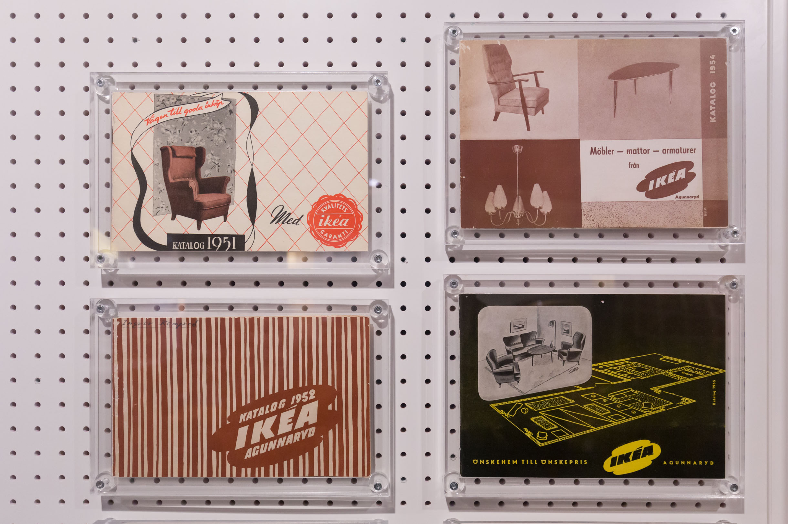

My journey to Scandinavia continued in  Älmhult, Sweden (2 hours of train ride from Copenhagen), after the Design Matters conference. It was the home of the biggest furniture retailer in the world - IKEA. The town as the headquarter of IKEA, offers a museum and also a hotel, just for the visitors.

##Experience Design in 1950s

<small>Print ad of IKEA in 1950.</small>

IKEA was founded as a mail-order business by Ingvar Kampradin 1943. It grew and started selling furniture a few years later. In 1951, The first IKEA catalog is published.

IKEA catalog is such an iconic part of the brand, this has been the tradition carried on for nearly 70 years. The catalog embodies the vision of IKEA, also putting their product in context. Reading the catalog made it unstoppable imagining IKEA furniture in your home. 

<small>First cover of IKEA catalog in 1951.</small>

Of course, the journey of experience design expanded through the showroom. Furniture is delicately decorated as a full bedroom, dining room, kitchen etc. Everything has to be seen and touched, in order to demonstrate the quality of the product. 

It was Experience Design in today’s term, customers are immersed through company’s mediums to see a better version of their home, triggering a deeper connection to build personal space. That is completely different from the usual routine of replacing broken furniture from furniture stores.

##Ikea Democratic Design

IKEA has become the icon of Scandinavian design and culture after it has rapidly expanded around the world. Their design manifesto “IKEA Democratic Design” was the core philosophy to develop products for tens of millions home around the world.

“Form, Function, Quality, Low Price and Sustainability” are five principles that all IKEA products have to meet. Part of the museum features the process of Democratic Design. It might sound impossible to meet all five principles, but this requirement pushed so many innovations in the company’s product catalog to be fashionable, sustainable, durable while with a low cost of production. Allen key was one of the examples that have become the iconic symbol of the Do-It-Yourself movement. 

I’m reading the book “IKEA Democratic Design” right now, available to purchase in the museum, will share more insights after finishing the book. 