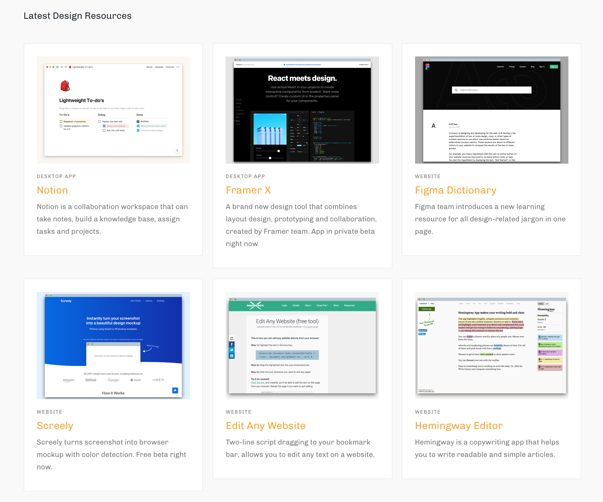
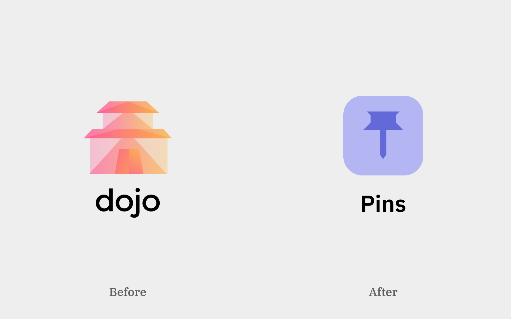
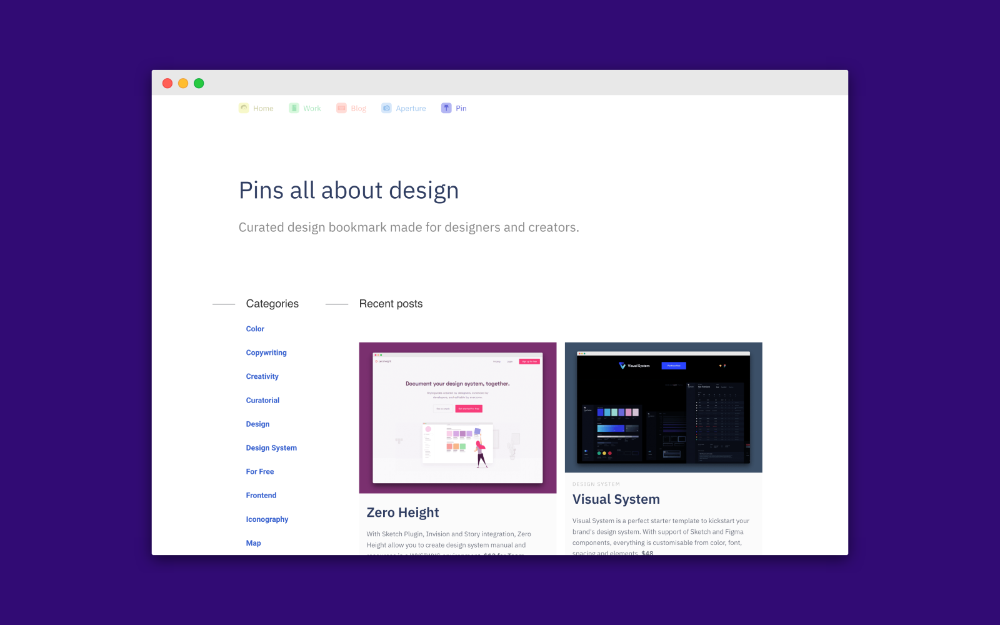

---

date: "2018-12-11"

title: "Lessons learned from personal project"

category: "Work In Progress"

tags: 
- "gatsby"
- "personal project"

cover: "./Pin.png"

---

###Getting Started.

There is no better time to start your personal project than today. I have been living in the bubble of agency model for years taking client projects. There were regrets and compromises accommodating with clients’ need and reality. I have always wondered the decision that I would make if I'm in charge. 

So, when the idea of building a design resources site strikes me, I immediately started to test out the idea all by myself. I put aside all the standard design workflow in my agency. No more writing specs, no more wireframing. There were a few mockups created. And I built a prototype purely using Webflow.

It's called Today Dojo, aiming to provide daily resources for designers and creators to step up their game.

###Quick iteration meaning to adapt faster and better.

I have pivoted 2 times and then rewrote the whole site for once. The initial idea was to build a browser extension that delivers daily resources to users' new tab. But the idea has scaled down to a website first, since the content is all that matters.

So I used Webflow to experiment the whole project with its own CMS and hosting. Webflow excels at building launch-ready websites instead of static mock-ups. Its customised CMS allows me to set up the database with rich media. Photos, text, link and date, reference entries (tags and categories) can be previewed instantly.

###The sooner I kickstart operation, sooner I realise real problems.

All plans sound perfect on paper. My initial plan is to hunt 10 resources every day, I even designed the website layout for the content update cycle. But it only took a week of operation, for me to realise such workload is too overwhelming, Given that I’m working on a part-time basis. And the site should value quality over quantity anyway. Webflow allows me to quick adjusting the layout and my schedule, lining up with social media and newsletter.

###Finding the value and sustainability is key.

After the site has launched, I have managed to bring adequate traffic to the site. Even though there were plans on monetizing the website, but it was too early to do so. A bigger question arises:

> How do I find time and money to keep it going? 

At the same time, I'm also finding myself desperately need more time and sources to research on my content. I need to strike a balance between acquiring new content and expanding on design categories.

###Scaling down is the step up not a step back.

So after two months of part-time running the site, I have decided to rollback to a smaller scale. Here are the main reasons:

1. You'll see there's a cost of using a code-free solution, [Webflow's CMS hosting plan](https://webflow.com/hosting) cost USD $16 per month alone. If you have more than 2 projects, you'll need to pay another USD $16 for pro membership subscription.
2. I felt that running a separate social media accounts are time-consuming. Even I have already using aggregated social media tools like Buffer. Scheduling and reposting content from the site simply does not worth the effort.

While I was launching a curatorial site, I was also learning to code my own portfolio. So when my portfolio has completed, I asked myself why not code my own project as well? So I rewrite the site using [Gatsby.JS](https://www.gatsbyjs.org/) Using Github and Netlify, I hook up with backend platform [Prismic.io](https://prismic.io) with Gatsby Prismic Starter. The cost then cut down to be free while I could still update site content separately.

Another thing I did is rebranding. I roll back the site into a subsidiary site under my personal domain. Renaming the site with a coherent name and navigation bar makes the experience more unified among my other sites. It also adds more regular content to my personal twitter account with human touch, rather than reposting content like a bot. 

Now the site is renamed to be Pins, and available to browse right now at [https://pin.desktopofsamuel.com](https://pin.desktopofsamuel.com). Old site is also available on [http://dojotoday.webflow.io/](http://dojotoday.webflow.io/). Check it out now! 
